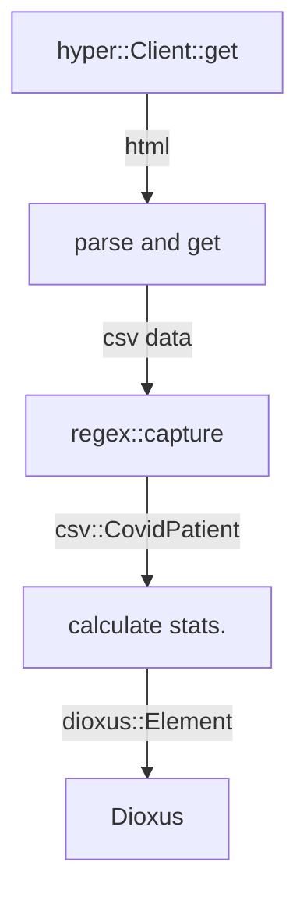

# Fukuoka COVID-19 stats viewer

Swift版から移植。2022年9月27日で更新停止したので意味なくなった。

- [dioxus](https://github.com/DioxusLabs/dioxus)
  - [the guide](https://dioxuslabs.com/guide/)
- [福岡県新型コロナウイルス感染症陽性者発表情報](https://ckan.open-governmentdata.org/dataset/401000_pref_fukuoka_covid19_patients)

## Flow




## Note

2022-04-14

数日前からデータが取れなくなった。多分32万行を超えて何かの上限になったのだろう。。

2022-02-15のデータが壊れとるがな！第1フィールドが数値にならないので気いつけや。

```
 - fail to convert data: あｑ,400009,福岡県,2022/02/15,火,糟屋郡,80代,女性
 ```
