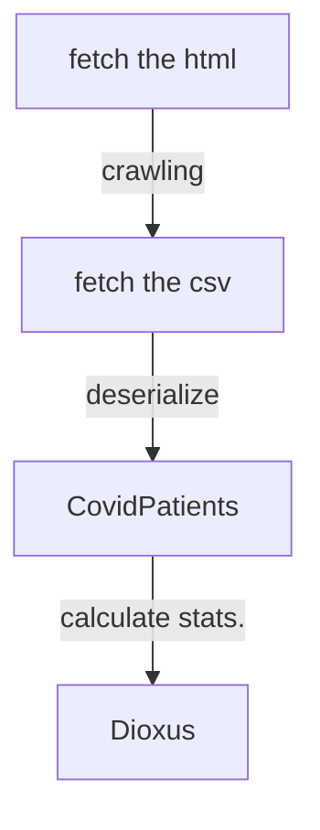

# Fukuoka COVID-19 stats viewer

Swift版から移植。

- [dioxus](https://github.com/DioxusLabs/dioxus)
  - [the guide](https://dioxuslabs.com/guide/)
- [福岡県新型コロナウイルス感染症陽性者発表情報](https://ckan.open-governmentdata.org/dataset/401000_pref_fukuoka_covid19_patients)

## Flow

